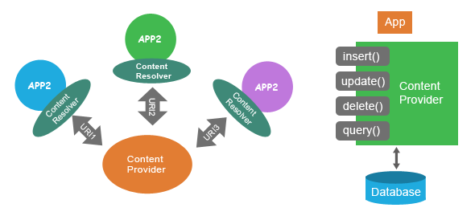

# Content Provider
A content provider manages access to a central repository of data. A provider is part of an Android application, which often provides 
its own UI for working with the data. However, content providers are primarily intended to be used by other applications, which access 
the provider using a provider client object.<br>
<p align="center"></p><br/>

```CRUD : CREATE, READ, UPDATE, DELETE```

## 1. Content Resolver
1. By using content provider, users can choose to share only some part of the data in one application, thus can avoid privacy data leak in the
program. At present, the use of content provider is the standard way for Android to share data across applications.<br>
2. A content Resolver is a proxy that shields apps from details of how content providers are accessed.<br/>
```ContentResolver cr= context.getContentResolver();```
## 2. Content URI
Content URI is a unique resource identifier that content provider app provides for client app to access it’s shared data.
```content://authority/path/_id```<br>

```content://content://com.student.details/student```

```content://content://com.student.details/students/3```

***1.schema :*** This is the content URI protocol, it’s value is content in general.<br>
***2.authority :*** This part is used to distinguish different content provider app to avoid conflict, so generally it is the app package name.<br>
***3.path :*** This part is used to distinguish different shared data in one android content provider app. Different path will return different data.

## 3. Steps to create Content Provider.
1. AndroidManifest.xml<br>
```xml
  <provider
            android:name=".StudentContentProvider"
            android:authorities="com.student.details"     //authority for uri
            android:enabled="true"
            android:exported="true">
</provider>
```
2. Create Content Provider by extending **ContentProvider** class and declare necessary methods and constants.
```java
  public class StudentContentProvider extends ContentProvider { 
   
    public static final String AUTHORITY_NAME="com.student.details";
    public static final String URL="content://" + AUTHORITY_NAME+"/students";
    public static  final Uri CONTENT_URI=Uri.parse(URL);
    
    
    public static final String _ID="_id";
    public static final String NAME="name";
    public static  final String GRADE="grade";
    static final String DATABASE_NAME="College";
    static final String STUDENTS_TABLE_NAME="students";
    static final int DATABASE_VERSION=1;
  }
```
3. Creating Helper class : A helper class to manage database creation and version management.<br/>
   You create a subclass implementing ```onCreate(SQLiteDatabase), onUpgrade(SQLiteDatabase, int, int) and optionally onOpen(SQLiteDatabase),``` and this 
   class takes care of opening the database if it exists, creating it if it does not, and upgrading it as necessary. Transactions are used to make 
   sure the database is always in a sensible state.<br>
   
   ```java
    static final String CREATE_DB_TABLE= "CREATE TABLE "+STUDENTS_TABLE_NAME+
            "("+_ID+" INTEGER PRIMARY KEY AUTOINCREMENT, "+ NAME + " TEXT NOT NULL,"+GRADE+" TEXT NOT NULL);";
   ...
   
   private static class DatabaseHelper extends SQLiteOpenHelper
    {
        DatabaseHelper(Context context)
        { 
          //SQLiteOpenHelper(Context context, String name, SQLiteDatabase.CursorFactory factory, int version)
            
            super(context,DATABASE_NAME,null,DATABASE_VERSION);   
        }

        @Override
        public void onCreate(SQLiteDatabase db) { 
            // Called when the database is created for the first time
            db.execSQL(CREATE_DB_TABLE);
        }

        @Override
        public void onUpgrade(SQLiteDatabase db, int i, int i1) {
            // Called when the database needs to be upgraded.
            db.execSQL("DROP TABLE IF EXISTS "+STUDENTS_TABLE_NAME);
            onCreate(db);

        }
    }
   
   ...
    
    @Override
    public boolean onCreate() {
        Context context =getContext();
        DatabaseHelper dbHelper=new DatabaseHelper(context);

        db=dbHelper.getWritableDatabase(); //Create and/or open a database that will be used for reading and writing.
        return (db==null)?false:true;
    } 
   ```
 
  
 4. declare UriMatcher for easy URI matching.
    ```java
    static final int STUDENTS=1;
    static  final int STUDENT_ID=2;
    static final UriMatcher uriMatcher;
    static{
        uriMatcher=new UriMatcher(UriMatcher.NO_MATCH);
        uriMatcher.addURI(AUTHORITY_NAME,"students",STUDENTS);  //addURI(String authority, String path, int code)
        uriMatcher.addURI(AUTHORITY_NAME,"students/#",STUDENT_ID);

    }
    
    ...
     switch(uriMatcher.match(uri))
        {
            case STUDENTS:
                     qb.setProjectionMap(STUDENTS_PROJECTION_MAP);
                     break;
            case STUDENT_ID: qb.appendWhere(_ID+"="+uri.getPathSegments().get(1));
        }
    ```
    
   5. Implement insert(), query(), update(), delete()
      
      ```java
      public Uri insert(Uri uri, ContentValues values) {
      ...
      }
      ```

      ``` java
         public Cursor query(Uri uri, String[] projection, String selection,
                        String[] selectionArgs, String sortOrder) {
                        ...
          }
       ```
      
      ```java
       public int update(Uri uri, ContentValues values, String selection,
                      String[] selectionArgs) {
                      ...
        }  
        ```
        ```java
        public int delete(Uri uri, String selection, String[] selectionArgs)
        {
          ...
        } 
        ```
   
    

