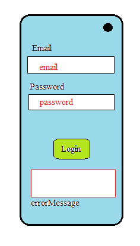

# Goal : developing Sustainable Application

Sustainable means how well your app can evolve over time and be supported (survive inside AppStore).<br>
(adding new features, fixing bugs, security threats, etc.)

## Software Engineering as a Search

Creating software is a search process. Eg. Let consider an example of HOT/COLD game, in which person has to move from position X to Y(unknown to X).
There is a moderator who will tell you about your moves. Moves are defined as Hotter(means closer to the solution) and colder(farther from the solution). In
this way you have to move from point X to unknown point Y.

In similar way Software Engineering is the process of searching hotter solution which can fullfill the need of the clients according to their requirements.

When we have to create an application/ Software we generally go through following steps:<br>
1. Build or change
2. Measure or evaluate
3. Termination criteria.

## Why Test ?
(sustainable app dev) (evolving apps)

Everytimes we change anything inside an application, we should have to have a way of meaasuring its impacts.
```java
problem: How do we know what to test ?
         --> Test as much as possible.
```

### UNIT TESTING

An application consist of many interconnected components. When we tested the application as a whole, then it will difficult to identify the bugs or error.

-->Unit Testing seperates the component and isolate them. (easy to detect bugs)
-->By unit testing we can pin point error on particular component and fix it.

### Unit Testing using Java JUnit framework.

 ```java 
   -->java
        -->code
        -->AppicationTest
        -->(test)UnitTest 
 ```
    
    
  ```java
     LoginUtils.java
         boolean isValidEmailAddress(String email)
         { 
            boolean hasAtSign=email.index("@")>-1;
            return hasAtSign;
         }
  ``` 
     
     
     
  ```java 
        LoginUtilsTest.java
        
        public class LoginUtilsTest{ // creating new instance for each Test
        
          private LoginUtils utils;  
         
           @Before
           public void setup() // execute before ever test
          {
             utils=new LoginUtils();
          }
         
          @Test
           public void aValidEmailAddressPasses() throws Exception // Test Method
          {
             assertTrue(utils.isValidEmailAddress("foo@bar.com"));
          }
     }
  ```

## The Importance of Test Automation
Manual testing is time consuming task. (slow test->bug->developer)(focus on changes).<br>

### Solution : Test Automation.
Writing code for things user will interact with application. (programmatically click and check).

*Downside : Could be manually Tested.*


## Code Coverage

``` 
How to measure tests themselves ?
        --> some metric needed
```
Code coverage metric senses most things covered by your code or not.

``` java
 public class Foo
 {
         public int bar(int a)
         {
                  if(a>1)
                    ...
                    else
                       ...
          }
   }
```
In above case, 1 method is covered (method wise code coverage is 100%).<br>
But, cases wise we required two values of a [ a>1, a<1 ] to cover all test cases.<br>

***Code coverage tells " how much portion of a software has been tested or hasn't been tested by code. It doesn't mean that your application
is perfect or good, if it achieves particular code coverage score.***


## Functional and Non Functional Properties

***1. Functional properties***<br>
         ->Input to output (does it produce correct output?)<br>
***2. Non Fuctional Properties***<br>
         -> performance<br>
         ->Security<br>
         ->Extensibility<br>

## Refactoring and Regression Testing

Refactoring is a concept in which we don't add any new features, but it improves the non functional properties.

**problem : Refactoring the code might end up breaking previous code.**

Regression Testing is testing for refactored code.<br>
``` java
   A ---> Refactoring ---> a a' a" --->Regression testing.
```

## Integration Testing
Unit Testing alone is not sufficient.<br>

Testing in the context of eachother, how they interact with each other called Integration testing.

### Integration Testing with Android Studio

In android, integration tests are done with what are called Instrumentation tests.<br>

```java
public class GeoUtils{
         private GeoCoder geocoder;
         
         public GeoUtils(Context ctx)
         {
            geocoder=new Geocoder(ctx,Lov=cale.getDefault());
         }
         
         public String getCurrentZipCode(double lat, double lng)
         {
            List<Address> addressloc=geocoder.getFromLocation(lat,lng,1);
            return adressloc.get(0).getPostalCode();
          }
 }
```
          
``` java
@RunWith(AndroidJUnit4.class) // tells the system that run it as a Instrumental test
public class GeoUtilsIntegrationTest{
         /* Instrumental test runs on emulator or local connected device. build and test */
         
         private GeoUtils geoUtils;
         
         @Before
         public void setup()
         {
            Context ctx=InstrumentationRegistry.getContext();
            geoUtils=new GeoUtils(ctx);
          }
          
          @Test
          public void aTestLocation() throws Exception
          {
            String zipcode=geoUtils.getCurrentZipCode(36.139017,-86.6796924);
            assertEquals("37212", zipcode);
          }
 }
```
**Check dependencies inside Build gradle**


## Mock objects with Android Studio

1. Running Instrumental testing is slow as android studio has to buid, run and then test.<br>
2. It might be hard to get or create state that we want( for eg. Faking device location.)

**Library Mockito is used for creating mock objects for testing**<br>
--> Mock objects are stand-in for real objects, but they have a specific behavior that we define.<br>

``` java

@RunWith(MockitoJUnitRunner.class) // We're going to injecting mocks, these are by fake version of objects, into our test.
public class GeoUtilsTest{

@Mock
private Geocoder geocoder; // Mock object geocoder;

private GeoUtils geoUtils;

@Before
public void setup()
{
         geoUtils=new GeoUtils(geocoder);
}

@Test
public void coordinatesWithNoZipCodeResultNull() throws Exception
{
   String zipcode=geoUtils.getCurrentZipCode(0,0);
   assertNull(zipcode);
}
}
```
-->Run without launching Emulator with the help of mock objects.
--> problem earlier version of getCurrentZipCode() has a error of accessing null location get(0).

``` java
Fixing problem 1.0

public String getCurrentZipCode(double lat, double lng)
{
         List<Address> addressLoc=geocoder.getFromLocation(lat,lng,1);
         String zipcode=(addressLoc.size()>0)?get(0).getPostalCode();null;
         
         return zipcode;
}
```
***BUG FIXED NOW CREATING OUT TEST***

``` java
@Test
public void nashvilleReturns37212() throws Exception
{
         String zipcode=geoUtils.getCurrentZipCode(36.139017, -86.796924);
         assertEquals("37212",zipcode);
}
```
**Test failed because mock object doesnot know how to return location and returns empty list.**

``` java
Fixing Test

/* when(on this fun())
       .then return(this value);
 */
 
 @Mock
 private AddressForN;
 
@Test
public void nashvilleReturns37212() throws Exception
{        when( geocoder.getFromLocation(36.139017, -86.796924,1) ) 
                                                               . thenReturn( Arrays.asList(addressForN) );
         when( addressForN.getPostalCode() )
                                            . thenReturn("37212"); 
                                                            
         String zipcode=geoUtils.getCurrentZipCode(36.139017, -86.796924);
         assertEquals("37212",zipcode);
}

```
***Test Case passed -> created a mock object with behavior***

```java
general way to define behavior of mock object.

when(geoCoder.getFromLocation(anyDouble(), anyDouble(), anyInt())
                                                                 . thenReturn(Array.asList(addressForN));
```

**Check dependencies inside Build gradle**

## UI Testing with Espresso in Android Studio

<p align="center"> </p> 

```java

@RunWith(AndroidJUnit4.class)
public class LoginActivityClass
{

         @Rule
         public ActivityTestRule<LoginActivity> mActivityRule=new ActivityTestRule<>(LoginActivity.class);
         
         @Before
         public void setup()
         {
                  mActivity.getActivity();
         }
         
         @Test
         public void notIntiallyDisplayed()
         {
                  onView( withId(R.id.errorMessage) ). check(matches (not (isDisplayed()));
         }
         
         @Test
         public void testPasswordLengthRuleTriggersErrorMsg()
         {
                  onView(withId(R.id.password)). perform(typeText("abc"));
                  onView(withId(R.id.loginButton).perform(click());
                  
                  onView( withId(R.id.errorMessage) ).check( matches( isDisplayed() ).check(matches(withText("Bad Password") ) );
         }
         
          @Test
         public void testValidPasswordDoesnotDisplayErrorMsg()
         {
                  onView(withId(R.id.password)). perform(typeText("a long valid password"));
                  onView(withId(R.id.loginButton).perform(click());
                  
                  onView( withId(R.id.errorMessage) ).check( matches(not (isDisplayed()) );
         }
 ```
 
 **Check dependencies inside Build gradle**


   


     
     
        
        
