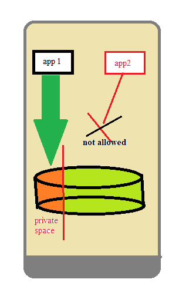

# Security and Sustainability

Building secure environment for application users.

## Economy of Mechanism

Economy of mechanism is about making things as simple as possible.<br>
--> avoid complex solutions.<br>
--> Don't build anything, you don't need it because you have to protect it over entire life of your app.

## Least Privilege

More privilegs (like camera, location, etc.) you takes, more potebtial thereis that these privileges can accidentally leaked to somebody else.
```
Once you take the privilege you become responsible for it.
```
``` xml
Example: Using
<uses-permission android:name="android.permission.ACCESS_FINE_LOCATION" />
for zipcode, we are voilating Least privilege rules.
       --> for zipcode we accessing location of user.
       --> Uses Gps costs battery life too.
       --> we can find zipcode by cell tower or wifi used by user.

<uses-permission android:name="android.permission.ACCESS_COARSE_LOCATION" />
```

## Complete Mediation

Building application may store sensitive data or sensitive capabilities. So, while designing such system we use the principle Complete Mediation.
<br>
```
Everytime accessing sensitive data
                    --> Check(valid access)
                            --> access Granted.
                    --> else Rejected.
```

## Secure Defaults

Default behaviour (Security) of the app must be secure.

Secure default is really about thinking through the design of your application and implementation. So that in every Line of code; in every configuration settings
in every installation decision, whatever you're doing, if the user or developer or system admin or whosoever, does nothing else, they will get security rights.

``` java
 example :
 
 public void onClick(View view)
 {
     if( v==LoginButton)
     { 
        // do login process
     }
     else
         if(v== RegisterButton)
         {
            // do register process
          }
         else
           {
               // forget password
            }
 }
 
 In above case, default case will going to run if none of the case is true. Creating loophole for attacker to attack.
 
 Developer should specify the particular case for it and avoiding default cases.
 by replacing default case by,
                      if(v==ForgetButton)
                      { 
                         //Forget password
                       }
                       else
                       { 
                          // Invalid click/ operation
                        }
```

## Traditional vs Mobile App Account
In desktop, we generally use one account that allow us to access data stored in local storage. But, in the case of Linux based system like android
system creates seperate user account for each application installed inside android environment.

<p align="center"> </p>

       
## App Account Mapping to Linux Users

When app get installed inside android environment, ***AndroidManifest.xml*** tells android information about application (Capabilities used by application <uses-permission>).

Android scans all the capabilities mentioned inside AndroidManifest.xml and then ask user for permissions
``` java
      if(permission granted)
           -> Takes all the user permission and creates an account on the linux operating system that's part of your app.
```

According to uses permissions, android figure out which different user groups (like camera group) your account should be associated with.
Example: Accessing camera, Android and underlying user account associated with the application checks if its psrt of linux user group that should have access to the camera.

## Apps Lies and Steal

<p align="center"> </p>

## How to protect Android Application

1. Each app has its user account that defines an area of the storage that assigned to the application.<br>
2. By default androids protects our data if we are not using any IPC mechanism for communication b/w applications.
3. Saving data at common space with different permissions.

## Privilege Escalation Attacks
Intent gives other application to communicates with other apps. Whenever we build applications that allows other activity to communicate with an activity, we have to very careful that the way  these activities behave, doesnot voilate the trust that's been placed in these activities in the terms of permission that have been given.
