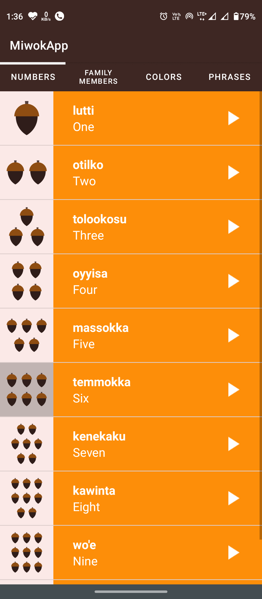

# Miwok App 
This app displays lists of basic vocabulary words for the user to learn Miwok language.
# Preview :

 
                                                            

                                                            
# Pre-requisities
1. Android SDK : **( minSdk 21 | targetSdk 30 )**
2. Android bulid tool : **com.android.tools.build:gradle:7.0.2**
3. To use Tab layout : **com.google.android.material:material:1.3.0**
# Features
1. Numbers
2. Colors
3. Family Name
4. Phrases

# Components Used:
1. ViewPager (FragmentPagerAdapter)
2. TabLayout
3. ListView + ArrayAdapter
4. MediaPlayer
5. AudioFocus

